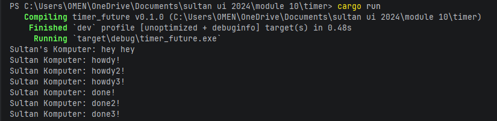

## 1.1 Original Timer From Book

## 1.2 Understanding how it works

Explanation: When spawner.spawn() is evaluated, the runtime dynamically wraps the async block into an allocated Task and registers it onto the receiver queue. Control is immediately returned to the synchronous execution context of main, printing "hey hey". The task queue remains un-polled until executor.run() invokes its processing loop, meaning no progress is made on "howdy!" or the TimerFuture sequence until that exact instruction is reached

This behavioral sequence perfectly illustrates the lazy execution model of asynchronous Rust

## 1.3 Multiple Spawn and removing drop

Explanation: Spawning multiple tasks allows the executor to interleave them, processing the queue concurrently. Consequently, all three "howdy" lines print back-to-back before the first timer finishes. Once the $2$-second delay elapses, the background threads wake the tasks, causing the three "done" lines to print in close succession. Commenting out drop(spawner) causes the program to hang indefinitely because the internal channel queue remains open. Dropping the spawner explicitly closes this channel, signaling the executor to shut down safely once the remaining tasks are empty.