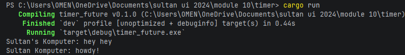
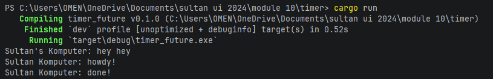

## 1.1 Original Timer From Book

## 1.2 Understanding how it works

Explanation: When spawner.spawn() is evaluated, the runtime dynamically wraps the async block into an allocated Task and registers it onto the receiver queue. Control is immediately returned to the synchronous execution context of main, printing "hey hey". The task queue remains un-polled until executor.run() invokes its processing loop, meaning no progress is made on "howdy!" or the TimerFuture sequence until that exact instruction is reached

This behavioral sequence perfectly illustrates the lazy execution model of asynchronous Rust

