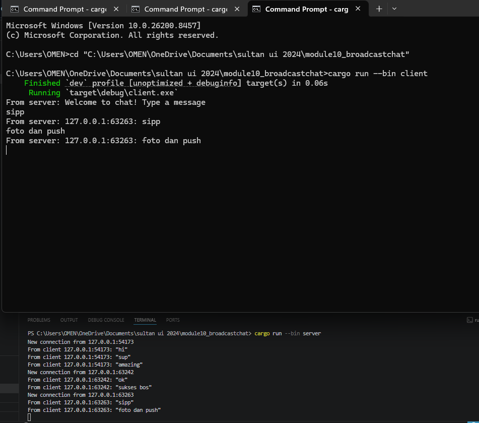
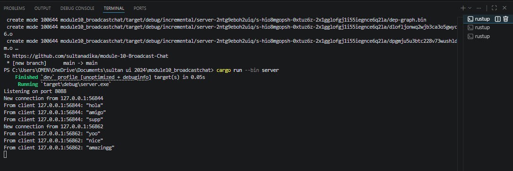
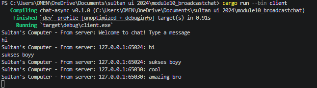
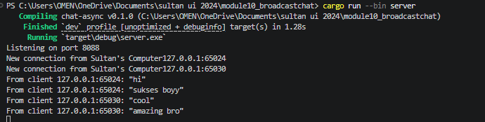

#  2.1: Original code, and how it runs

Explanation: Start the server using cargo run --bin server, then launch multiple clients across separate terminals with cargo run --bin client. When any client sends a message, the server instantly broadcasts it to all other active connections. This process relies on asynchronous execution, allowing the server to manage all client traffic concurrently without blocking.

## 2.2 Modifying Port

The port was changed from 2000 to 8088 in both server.rs and client.rs. The files are modified because WebSocket is a connection-based protocol. Both Server and Client file must use same port. ws:// prefix indicates it is using the WebSocket protocol. And after that the server manage all client traffic concurrently without any blocking.

# 2.3  Small changes. Add some information to client

 

(client side)

(server side)

explanation:

The server was modified to automatically prepend the sender's IP address and port to every broadcasted message. This update formats each text payload into a {addr}: {text} layout before pushing it into the broadcast channel. Because the server handles the central collection and rebroadcasting of communication traffic, this adjustment is exclusively required on the backend. The client code remains simple because it is only responsible for rendering whatever raw strings the server forwards down the pipeline. Ultimately, this design pattern allows all active chat members to immediately see who sent each message without modifying client-side processing